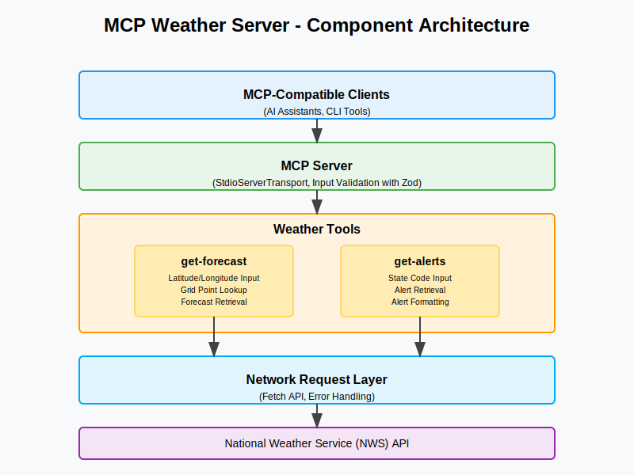

# MCP Weather Server

A robust weather server application built for MCP that provides real-time weather data and forecasts.

## Overview

MCP Weather Server is a Node.js/TypeScript application that serves as a backend for weather-related applications. It provides APIs for accessing current weather conditions, forecasts, and historical weather data.

## Features

- Real-time weather data retrieval
- Weather forecasting (hourly, daily, weekly)
- Historical weather data access
- Geocoding for location-based queries
- Customizable alerts and notifications
- Support for multiple weather data providers

## Architecture

The application follows a modular, layered architecture:

1. **API Layer**: RESTful endpoints for client applications
2. **Service Layer**: Business logic and data processing
3. **Data Access Layer**: Integration with weather data providers and caching
4. **Authentication & Authorization**: Secure API access

### Component Structure



The diagram above illustrates the main components of the MCP Weather Server:

- **Client Applications**: Web, mobile, and IoT devices that consume the weather API
- **API Gateway**: Handles request routing, validation, rate limiting, and authentication
- **Core Services**:
  - Weather Service: Provides current conditions, forecasts, and historical data
  - Location Service: Handles geocoding and location-based operations
  - Alert Service: Manages notifications and weather alerts
- **Data Access Layer**: Abstracts database operations and external API calls
- **External Services**: Weather API providers, MongoDB for storage, and Redis for caching

## Tech Stack

- Node.js
- TypeScript
- Express.js
- MongoDB (for data storage)
- Redis (for caching)
- Docker (for containerization)

## Getting Started

### Prerequisites

- Node.js (v18 or higher)
- npm or yarn
- MongoDB (optional, for data persistence)
- Redis (optional, for improved performance)

### Installation

```bash
# Clone the repository
git clone https://github.com/cskiro/MCP-Weather-Server.git

# Navigate to the project directory
cd MCP-Weather-Server

# Install dependencies
npm install

# Start the development server
npm run dev
```

## API Documentation

API documentation will be available at `/api/docs` once the server is running.

## Contributing

Contributions are welcome! Please feel free to submit a Pull Request.

## License

This project is licensed under the MIT License - see the LICENSE file for details.
